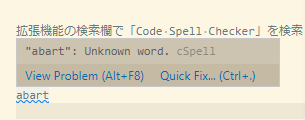

.. _development-cspell:

CSpell － ソースコードのスペルチェッカー
==============================================

`CSpell <https://cspell.org/>`_
はソースコードのスペルチェックを行うツール。
Visual Studio Code の拡張機能として使用できるほか、
コマンドラインツール ``cspell`` によるチェックもできる。

Visual Studio Code の拡張機能としての使用
---------------------------------------------

拡張機能の検索欄で「Code Spell Checker」を検索してインストールする。

インストールしていれば自動で動作し、スペルミスを検出した場合には下図のように指摘してくれる。

Quick Fix を選択すると修正候補が表示されるほか、
後述の設定ファイルに単語を登録して無視させるという選択肢も表示される。

コマンドラインツールとしての使用
------------------------------------

コマンドラインで利用する場合は、
npm コマンドを用意し、
``npm install -g cspell``
コマンドを実行することでインストールする。

.. hint::
    npm コマンドは Docker Hub にある Docker イメージ node をダウンロードするなどして用意する。

インストールし、後述の設定ファイルを用意したら、
``cspell lint <ファイルパスまたはファイルパスのパターン>``
のようにコマンドを実行することでスペルチェックを行う。
以下に実行例を示す。

..
    cspell:disable

.. code:: console

    $ cspell lint "**/*.h" "**/*.cpp" "**/*.py" "**/*.cmake" "**/*.txt" "**/*.md" "**/*.rst" "**/*.puml" "**/*.bib" "**/*.yaml" "**/*.json" "**/*.toml" "**/*.sh" --exclude "**/*.approved.*"
     1/33 ./doc/doxygen/namespaces.h 1030.53ms
     2/33 ./include/cpp_units/dummy.h 19.02ms
     3/33 ./tests/units/dummy_test.cpp 23.21ms
     4/33 ./tests/units/unity_source.cpp 2.82ms
     5/33 ./conanfile.py 293.11ms
     6/33 ./doc/sphinx/src/conf.py 85.90ms
     7/33 ./scripts/check_encoding.py 11.95ms
     8/33 ./scripts/install_conan_dependencies.py 18.64ms
     9/33 ./scripts/update_source_list.py 20.17ms
    10/33 ./cmake/ConfigureCcache.cmake 26.52ms X
    /builds/MusicScience37Projects/utility-libraries/cpp-units/cmake/ConfigureCcache.cmake:24:8 - Unknown word (TOUPPER)
    11/33 ./cmake/ConfigureSanitizer.cmake 41.50ms X
    /builds/MusicScience37Projects/utility-libraries/cpp-units/cmake/ConfigureSanitizer.cmake:24:8 - Unknown word (TOUPPER)
    /builds/MusicScience37Projects/utility-libraries/cpp-units/cmake/ConfigureSanitizer.cmake:26:48 - Unknown word (behaivior)
    /builds/MusicScience37Projects/utility-libraries/cpp-units/cmake/ConfigureSanitizer.cmake:30:56 - Unknown word (behaivior)

..
    cspell:enable

スペルミスは Unknown word と指摘される。
この例では behavior のスペルを誤ってしまったことを発見できた。

設定ファイル
----------------------

CSpell の設定ファイルは
``cspell.json``
などのファイル名で Git リポジトリのルートディレクトリなどに配置しておく。
（詳細は `Configuration <https://cspell.org/docs/Configuration>`_ を参照。）

形式は以下の通り。``words`` の欄にスペルミスとして検出して欲しくない単語を記載する。

.. code:: json

    // cSpell Settings
    {
      // Version of the setting file.  Always 0.2
      "version": "0.2",
      // language - current active spelling language
      "language": "en",
      // words - list of words to be always considered correct
      "words": [
        "MusicScience37"
      ],
      // flagWords - list of words to be always considered incorrect
      // This is useful for offensive words and common spelling errors.
      // For example "hte" should be "the"
      "flagWords": []
    }

.. important::
    Visual Studio Code の設定ファイル（``settings.json``）内に記載することもできるが、
    その場合は Visual Studio Code の拡張機能にしか適用されない設定となる。

個々のファイル内での一時的な設定
----------------------------------

特定のファイルにしかない単語を無視する場合などには、
ファイル内のコメントで一時的な設定を行う
`Inline Document Settings <https://cspell.org/configuration/document-settings/>`_
を使用する。

例えば、``cSpell:ignore <単語>`` の形式で無視する単語を指定することができる。

.. code:: cpp

    // cSpell:ignore bcdef

    void test() {
        const auto input = std::string("bcdef");  // ここの bcdef は指摘されない。
