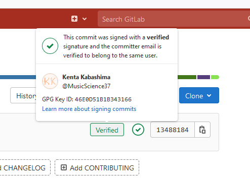

GPG 鍵の利用
====================

`GPG (GNU Privacy Guard) <https://www.gnupg.org/index.html>`_
の鍵を使用して Git のコミットに署名をすることができる。

GPG のインストール
--------------------

Ubuntu の場合、GPG は apt でインストールできる。

.. code-block:: console

    $ apt install gpg

Windows の場合、GPG は Git のインストールで一緒にインストールされた。

鍵の生成
--------------

次のコマンドで鍵を生成する。

.. code-block:: console

    $ gpg --full-gen-key

対話型で色々聞かれる。
以下に実行例を示す。
ただし、一部 ``<hidden>`` で隠している。
また、途中で CUI の表示が変わってパスワードを聞かれた。

..
    cspell:disable

.. code-block:: console

    $ gpg --full-gen-key
    gpg (GnuPG) 2.2.19; Copyright (C) 2019 Free Software Foundation, Inc.
    This is free software: you are free to change and redistribute it.
    There is NO WARRANTY, to the extent permitted by law.

    Please select what kind of key you want:
       (1) RSA and RSA (default)
       (2) DSA and Elgamal
       (3) DSA (sign only)
       (4) RSA (sign only)
      (14) Existing key from card
    Your selection? 1
    RSA keys may be between 1024 and 4096 bits long.
    What keysize do you want? (3072) 4096
    Requested keysize is 4096 bits
    Please specify how long the key should be valid.
             0 = key does not expire
          <n>  = key expires in n days
          <n>w = key expires in n weeks
          <n>m = key expires in n months
          <n>y = key expires in n years
    Key is valid for? (0) 0
    Key does not expire at all
    Is this correct? (y/N) y

    GnuPG needs to construct a user ID to identify your key.

    Real name: Kenta Kabashima
    Email address: kenta_program37@hotmail.co.jp
    Comment:
    You selected this USER-ID:
        "Kenta Kabashima <kenta_program37@hotmail.co.jp>"

    Change (N)ame, (C)omment, (E)mail or (O)kay/(Q)uit? O
    We need to generate a lot of random bytes. It is a good idea to perform
    some other action (type on the keyboard, move the mouse, utilize the
    disks) during the prime generation; this gives the random number
    generator a better chance to gain enough entropy.
    We need to generate a lot of random bytes. It is a good idea to perform
    some other action (type on the keyboard, move the mouse, utilize the
    disks) during the prime generation; this gives the random number
    generator a better chance to gain enough entropy.
    gpg: /home/kenta/.gnupg/trustdb.gpg: trustdb created
    gpg: key 46E0D51B1B343166 marked as ultimately trusted
    gpg: directory '/home/<hidden>/.gnupg/openpgp-revocs.d' created
    gpg: revocation certificate stored as '/home/<hidden>/.gnupg/openpgp-revocs.d/<hidden>.rev'
    public and secret key created and signed.

    pub   rsa4096 2021-08-04 [SC]
          <hidden>
    uid                      Kenta Kabashima <kenta_program37@hotmail.co.jp>
    sub   rsa4096 2021-08-04 [E]

..
    cspell:enable

公開鍵の確認
-----------------

まず、鍵の一覧を確認する。

..
    cspell:disable

.. code-block:: console

    $ gpg --list-secret-keys --keyid-format LONG
    /home/<hidden>/.gnupg/pubring.kbx
    ------------------------------
    sec   rsa4096/<ID> 2021-08-04 [SC]
          <hidden>
    uid                 [ultimate] Kenta Kabashima <kenta_program37@hotmail.co.jp>
    ssb   rsa4096/<hidden> 2021-08-04 [E]

..
    cspell:enable

``sec`` から始まる行の ``rsa4096/`` の後の ``<ID>`` の部分に出ている文字列をコピーして、
次のようにコマンドを呼び出すと、公開鍵が出力される。

.. code-block:: console

    $ gpg --armor --export <ID>
    -----BEGIN PGP PUBLIC KEY BLOCK-----

    （公開鍵がここに出てくる）

CUI 画面上に出てきた公開鍵を Git のリモートリポジトリ側に登録しておく。

git コマンドへの登録
----------------------

git コマンドへ GPG の鍵を登録するには、次のコマンドを実行する。
（``<ID`` は前節のものと同じ。）

.. code-block:: console

    $ git config --global user.signingkey <ID>

さらに、常に GPG の鍵で署名を行うために次のコマンドを実行する。

.. code-block:: console

    $ git config --global gpg.program gpg
    $ git config --global commit.gpgsign true
    $ git config --global tag.gpgsign true

WSL (Windows Subsystem for Linux) を使用する場合、さらに次のような環境変数が必要。

.. code-block:: bash

    export GPG_TTY=$(tty)

これを ``.bashrc`` に書くことでようやくコミットができた。

コミットへの署名の確認
--------------------------

コミットしたあと、署名がされたかどうかを確認するには、次のようにする。

.. code-block:: console

    $ git log --show-signature -1
    commit 271d7e50a2a8e1f6d4e95597d4e7bb63e3ac06d5 (HEAD -> master)
    gpg: Signature made Wed Aug  4 23:05:49 2021 JST
    gpg:                using RSA key EA7348F0A587E5BC2935B3AE46E0D51B1B343166
    gpg: Good signature from "Kenta Kabashima <kenta_program37@hotmail.co.jp>" [ultimate]
    Author: Kenta Kabashima <kenta_program37@hotmail.co.jp>
    Date:   Wed Aug 4 23:05:49 2021 +0900

        GPG の鍵を Git で使用するメモ

また、GitLab に push した場合は次のように GitLab の画面上でも確認できる。

    署名したコミットを GitLab の画面で確認した例

署名ができるかどうかの確認
------------------------------

署名付きのコミットを行おうとしてエラーが発生した際の原因の探索などで、
gpg の鍵が有効かどうか確認したい場合がある。
その場合は、次のようなコマンドを使用する。

.. code-block:: console

    $ echo 'test' | gpg --clearsign

成功時には次のような出力が得られる。

.. code-block:: console

    $ echo 'test' | gpg --clearsign
    -----BEGIN PGP SIGNED MESSAGE-----
    Hash: SHA512

    test
    -----BEGIN PGP SIGNATURE-----
    （ここでは省略）
    -----END PGP SIGNATURE-----

.. seealso::

    - `Sign commits with GPG | GitLab <https://docs.gitlab.com/user/project/repository/signed_commits/gpg/>`_
    - `WSL Ubuntu: git gpg signing Inappropriate ioctl for device · Issue #4029 · microsoft/WSL <https://github.com/microsoft/WSL/issues/4029>`_
    - `署名付きcommitでerror: gpg failed to sign the dataになるとき． <https://zenn.dev/taqxlow/articles/91c4da91e67a1b>`_
